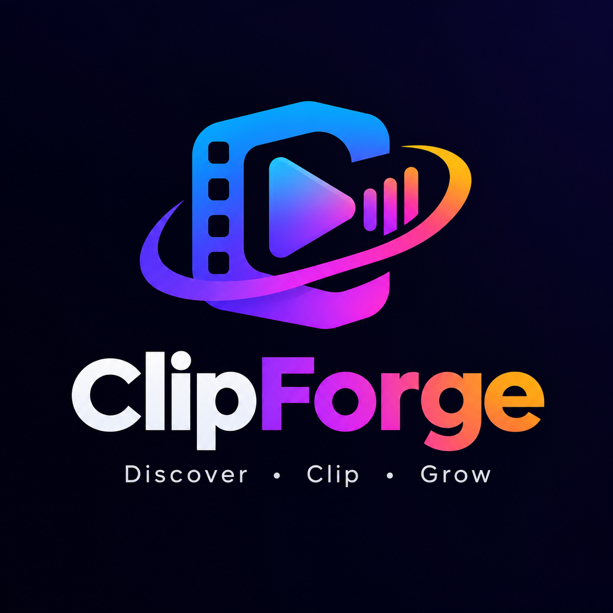

<div align="center">



# ClipForge

**A local-first AI content agent.**
Ingest long-form video, transcribe and analyse it on your own hardware, cut high-potential
vertical clips, review them from your phone, publish, and learn from what performed.

[](https://github.com/miltonthefirst/ClipForge/actions/workflows/ci.yml)
[](LICENSE)
[](apps/worker/pyproject.toml)
[](apps/web/package.json)

</div>

---

> [!NOTE]
> **Status: `v0.1.0`, and the pipeline runs end to end.** Paste a YouTube URL from your phone; the
> worker transcribes it locally, ranks candidate moments, cuts and captions a vertical clip, writes
> its title from what is actually on screen, and hands it back for review — with video that plays on
> the phone. A clip you disagree with can be re-framed, re-voiced in another language, and have a
> broadcaster's logo covered, and the corrections it learns from you are proposed rather than
> applied. Approved clips publish to YouTube from the machine that holds both the file and the token.
>
> Working towards `v0.2.0`, which closes the loop by measuring whether any of the scoring predicted
> anything. See [`docs/PLAN.md`](docs/PLAN.md) for the milestone plan and where things stand.

## Why

Cloud AI video pipelines are metered per-minute and per-token. ClipForge moves every expensive
operation — transcription, semantic analysis, encoding — onto commodity local hardware, and uses
the cloud only for the three things it is genuinely good at: **identity**, **small structured
state**, and **reaching your phone**.

The reference machine is an RTX 3050 with **6 GB of VRAM**. That constraint is not incidental; it
shapes the architecture. Whisper and the analysis LLM cannot be resident at the same time, so GPU
residency is scheduled explicitly and jobs are checkpointed pipelines that can resume mid-run.

## Architecture

```text
┌───────────────────────────────┐
│  PWA - Angular + Tailwind     │   Submit, watch progress, review, approve
│  installable, offline shell   │
└───────────────┬───────────────┘
                │ Firebase SDK (as the signed-in user)
                ▼
┌───────────────────────────────┐
│  FIREBASE - control plane     │   Auth · Firestore · FCM · Hosting
│  Blaze, since Sept 2026       │   rules enforce the write surface
│  Storage: 5-day clip copies   │   the lease reaper runs on the worker
└───────────────┬───────────────┘
                │ Admin SDK - onSnapshot, transactional lease claim
                ▼
┌───────────────────────────────┐
│  LOCAL WORKER - Python 3.12   │
│                               │
│  Scheduler ── GPU lane (1) ───┼─▶ faster-whisper ─┐
│            └─ CPU lane (N) ───┼─▶ Ollama LLM  ────┼─ ModelBroker (exclusive,
│                               │   vision model ───┤   and non-reentrant)
│  Stage runner + checkpoints   │   yt-dlp ─────────┤
│  File server    127.0.0.1     │   ffmpeg/NVENC ───┘
│  Control API    127.0.0.1     │
└───────────────────────────────┘
     master files + bin stay here
```

**The worker holds the master; the bucket holds a copy you can watch.** An `UPLOAD` job puts a clip
in Cloud Storage so the PWA plays real video on any device, and a lifecycle rule expires it after
five days — the copy exists so somebody can watch and decide, and a decision that has not been made
in five days is not waiting on video. The local file stays put and is what every later correction
re-cuts from.

This was the other way round until September 2026: ClipForge was built for the Spark free tier, where
a phone got a poster frame and a transcript excerpt and nothing else. That is fine for a talking head
and useless for football, where every judgement — did the crop keep the ball, does the narration line
up, is the logo still there — is about motion. All artefact writes go through a `BlobStore` port, so
the switch really was one adapter and one environment variable. See
[ADR-0018](docs/adr/0018-blaze-and-a-short-lived-bucket-copy.md) and the
[ADR-0009](docs/adr/0009-spark-tier-local-artefacts.md) it supersedes.

Full detail, including the data model and the job/lease protocol, is in
[`docs/PLAN.md`](docs/PLAN.md).

## Repository layout

| Path | What lives there |
| --- | --- |
| [`apps/web/`](apps/web) | Angular 22 + Tailwind PWA |
| [`apps/worker/`](apps/worker) | Python 3.12 worker — the whole pipeline |
| [`apps/desktop/`](apps/desktop) | Tauri shell: supervises the worker, hosts the PWA |
| [`packages/contracts/`](packages/contracts) | JSON Schema → generated TypeScript + Pydantic types |
| [`firebase/`](firebase) | Security rules, indexes, Cloud Functions |
| [`docs/`](docs) | [Plan](docs/PLAN.md), [ADRs](docs/adr) |
| [`tools/`](tools) | `doctor.ps1` and dev scripts |

## Getting started

### Prerequisites

Install these once. `doctor` will tell you if anything is missing or wrong.

| Tool | Install | Why |
| --- | --- | --- |
| [uv](https://docs.astral.sh/uv/) | `winget install astral-sh.uv` | Provisions Python 3.12 and locks dependencies |
| [ffmpeg](https://www.gyan.dev/ffmpeg/builds/) | `winget install Gyan.FFmpeg` | **Full build required** — the essentials build lacks `libass` |
| [Node 20+](https://nodejs.org) | `winget install OpenJS.NodeJS.LTS` | Builds the PWA |
| [Ollama](https://ollama.com/download) | — | Runs the analysis LLM |
| NVIDIA driver | — | Only for GPU inference; the repo builds and tests without one |

> You do **not** need to install Python yourself. `uv` provisions Python 3.12 for the worker, and
> whatever Python is on your PATH is irrelevant. See
> [ADR-0003](docs/adr/0003-uv-managed-python-toolchain.md).

### Setup

```bash
git clone https://github.com/miltonthefirst/ClipForge.git
cd ClipForge

# Worker. Omit --extra gpu on a machine with no NVIDIA card;
# everything except real inference still works.
uv sync --project apps/worker --extra gpu --extra media

# PWA
npm ci --prefix apps/web

# Analysis model (~3.4 GB)
ollama pull qwen3.5:4b

# Configuration
cp .env.example .env
```

### Verify

```powershell
pwsh -File tools/doctor.ps1
```

```text
  ClipForge doctor
  ----------------
  [PASS] git                    git version 2.54.0.windows.1
  [PASS] node                   v24.16.0
  [PASS] uv                     uv 0.12.10
  [PASS] ffmpeg                 ffmpeg version 9.0.1-full_build
  [PASS] ollama                 ollama version is 0.33.3
  [PASS] python (worker venv)   Python 3.12.14
  [PASS] ffmpeg                 h264_nvenc, libx264, ass, loudnorm, silencedetect present
  [PASS] gpu                    NVIDIA GeForce RTX 3050 * 6144 MiB total * 5444 MiB budget
  [PASS] cuda_libs              registered 3 DLL director(ies): cublas, cuda_nvrtc, cudnn
  [PASS] cuda_transcribe        CTranslate2 ran on device='cuda' compute_type='int8_float16'

  All checks passed. This machine can build and run ClipForge.
```

`doctor` exits with the number of failed checks and prints a suggested fix for each, so it works
in a script as well as by eye. Use `-SkipGpu` on a machine without an NVIDIA card.

### Remaking a clip that came out wrong

Every clip in the review queue has a **Remake** panel. It takes a note in your own words and
produces a *new* clip — the one you are watching is never altered, so there is nothing to undo and
you can still prefer the original once you have seen both.

**Framing.** The pipeline's default is a fixed 9:16 window that does not move, which keeps about a
third of a landscape frame's width. That is right for a talking head and wrong for anything where
the interesting thing moves — a ball leaves that window several times a minute. Three alternatives,
per clip:

| Mode | Use it when | It costs |
| --- | --- | --- |
| **Fit the whole frame** | Things are being cut off at the sides; you want the whole pitch | A smaller picture, with a blurred or solid backdrop filling the rest |
| **Follow the action** | The subject moves and the clip loses it | It follows *motion*, not a ball — it can chase the wrong thing, and it records the path it took so you can correct it |
| **Fix it to one side** | The subject stays put, off-centre | Nothing; it is the default with a different anchor |
| **Move it by hand** | The automatic answers got it wrong | Your time, per clip — seedable from whatever the last remake did |

**Voice and language.** Optional, and needs one extra install:

```bash
# Every extra you already have, plus speech. `uv sync` prunes whatever you do
# not name, so dropping --extra gpu here would quietly uninstall Whisper.
uv sync --project apps/worker --extra gpu --extra media --extra speech
uv run --project apps/worker clipforge-worker fetch-voices   # ~330 MB, Apache-2.0
```

The weights land in `~/.clipforge/`, which is where the worker looks from
whatever directory it was started in.

The clip's own words are translated and re-spoken, or you write a script. The original audio is
either replaced or ducked underneath. Captions are burned into the picture, so a new voice makes the
old ones wrong — *Redo captions* transcribes the new narration to recover timings that match what
was actually said.

**What it will refuse.** A remake does not narrate everything it is handed. If the
clip's audio is music, the recogniser produces boilerplate — *"Here is a nice
musical instrumental for you"* — and speaking it would be worse than silence, so
it is refused with a reason. The same applies to a script that reads like an
instruction rather than a line to say, a window with almost no speech in it, and
a translation that comes back as the language it started in. Anything the note
asks for that ClipForge cannot do — changing the music, slow motion, cutting the
middle out — is listed on the finished clip instead of being quietly skipped.

> **What re-voicing is not for.** It changes the soundtrack and nothing else. On third-party footage
> the picture is still the picture, and it is the picture a rights holder's matching runs against.
> This helps with a claim on commentary or music, and it opens a clip to an audience that does not
> speak the original language. It does **not** make footage safe to publish — see
> [Rights and responsible use](#rights-and-responsible-use).

**You can tidy up, and the tidying cannot cost you a file.** Clips, sources, candidates and jobs
can be deleted from the web app; deleting a source takes its clips and candidates with it, and the
confirmation counts them first. **None of that touches the media.** Removing the video itself is a
separate act on a separate screen — **Settings ▸ Storage**, which works in the desktop app because
it talks to the machine holding the files — and what it removes goes to a bin that nothing empties
on a schedule. Put it back, or delete it for good, whenever you like. Anything you published keeps
its record either way. See [ADR-0017](docs/adr/0017-deleting-a-record-is-not-deleting-a-file.md).

**It looks at the clip before it says anything about it.** Re-voicing used to be "translate the
transcript", which is right exactly as often as the transcript is — and on stadium commentary that
is not often. A clip once went out saying *"very bad beauty glim this pure left lateral munitions
shot"*, because a speech recogniser mangled the French and a translator rendered the mangling
faithfully. Now three frames go to a vision model first, and the narration is **written** from what
is on screen and what was said together. Same clip, same footage: *"Pavlovitch makes a good pass to
break through the first line. Kane can curl it with his right foot."*

**Titles, descriptions and tags follow the language.** Change a clip to English and its title,
description and tags are rewritten in English, for a feed rather than for an archive: the hook in
the first few words, the searchable nouns in the tags, hashtags on their own line. They used to be a
fragment of raw transcript and a sentence explaining why the clip had been selected. Anything the
system names but cannot back up from the clip or its source is flagged on the clip, so a guessed
opponent is something you are told about rather than something you publish.
See [ADR-0016](docs/adr/0016-looking-at-the-clip-before-speaking.md).

**It can hide what the broadcaster burnt in.** Tick *Hide logos, watermarks and burnt-in text* on
a remake, or just write "blur the channel logo" in the note, and it looks through the footage for
anything holding still while the rest of the picture moves — a channel bug, a score bar, a clock
— and covers it. A small mark is rebuilt from its surroundings and disappears completely; a larger
one is blurred. What was hidden is listed on the finished clip, and one button turns it into a
property of the channel: after that, every clip cut from that source arrives with it already gone.
See [ADR-0015](docs/adr/0015-hiding-what-is-burnt-into-the-picture.md).

**One clip is one row.** A remake produces a new clip, but the queue shows the latest version of
each and keeps the rest as history — what you asked for at each step, what the machine made of it,
and what it could not do. Rejecting a remake brings the version before it back.

**It learns, and asks first.** After a remake that carried a note, it works out whether anything
there would help on a *different* clip from the same source — "commentary on this channel should be
in English" — and offers it at the top of the review queue. Nothing is applied until you keep it,
an accepted preference only fills in settings you left open, and anything you turn down is never
suggested again. See [ADR-0014](docs/adr/0014-learning-from-feedback.md).

**From a terminal**, if you would rather not reach for a phone:

```bash
uv run --project apps/worker clipforge-worker remake CLIP_ID --framing TRACK
uv run --project apps/worker clipforge-worker remake CLIP_ID --language es
uv run --project apps/worker clipforge-worker remake CLIP_ID --notes "it cuts in too late"
```

Two things worth knowing before you reach for it:

**Reframing needs the original video; changing the voice does not.** A rendered clip has already
thrown away the pixels outside its window, so a reframe re-cuts from the source — which the
workspace collector reclaims after a while. Clips outlive sources, so this fails on older clips and
says so. Swapping the audio copies the video stream untouched, so it works either way and takes
seconds.

**The picture is never stretched to fit the narration.** A translated script often runs longer than
the original; the clip stays the length you approved and the overrun is reported on it rather than
absorbed. See [ADR-0013](docs/adr/0013-remake-as-a-job.md).

### Finding what to make, and making one clip from several

Everything above starts with a URL you already had. **Trends** finds them. Say what the channel is
about — or say nothing — and press the button; the worker asks three places and comes back with a
ranked list of what is moving and the videos that carry it:

| Where it looks | What it knows | What it does not |
| --- | --- | --- |
| Google Trends' daily feed, per country | What people are searching for, with a rough volume | Anything about video |
| The top of a few subreddits, over the last day | What people are sharing — and, often, the video itself | How many upvotes; the feed carries none |
| A YouTube search sorted by views and filtered by date | What has been uploaded about a topic and how fast it is being watched | It is a search, so it always finds *something* |

None of them needs an API key, and none of them is a trend on its own. **Agreement between them
is**, and that is what the score weights most: how many sources agree, how loudly, how recently,
and whether there is any video to cut. The ranking is arithmetic, so a row that ranked oddly can be
explained by reading its parts; the local model is asked afterwards, per row, for the one thing
arithmetic cannot supply — a sentence saying what a clip about this would actually *be*, and
whether it belongs on a channel about your topics — and the list is still ranked without it.

Each video on the list is one press from the pipeline. **Clip it** submits its URL exactly as if you
had pasted it. **+ Compile** gathers it, and a few of those become a **compilation**: one vertical
clip cut from the best moment of each video, for a theme, with the theme on a card in front and a
dip to black between the pieces. The worker fetches every video as it would for a clip, transcribes
each, asks the model for the moment that most belongs to the theme — not merely the strongest —
and joins what it cut. The result is a clip like any other: it arrives in the review queue, plays on
the phone, takes music, publishes. Its page lists every piece, the window that was cut, and whose
idea each window was, so a compilation that came out wrong says which piece to change.

**Or on a schedule.** *Do this automatically…* under the same form saves its settings as a
schedule — daily at a time of day, or every so many hours — and the worker fires it on its own
while it is running. Each run turns up on the Trends page marked *auto*, exactly like a manual one.
A worker that was off fires each due schedule once when it comes back, not once per missed
slot, and a run still going is never fired over. See
[ADR-0023](docs/adr/0023-research-on-a-schedule.md).

**What it refuses to do.** Go further than the list. Nothing is promoted, compiled or published
without a press; a schedule produces a proposal on a timer, and every step from it is yours. A dead link among the pieces is left out
and named rather than failing the lot; fewer than two pieces is a clip, not a compilation, and is
refused as such. A compilation cannot be *remade* — there is no single source to re-cut from — and
its page says so and points at the Compile page instead.

**From a terminal:**

```bash
uv run --project apps/worker clipforge-worker research -t "premier league" -t "formula 1" --region GB
uv run --project apps/worker clipforge-worker trends JOB_ID        # the ranked list, once it has run
uv run --project apps/worker clipforge-worker compile URL1 URL2 URL3 --theme "best goals of the week"
uv run --project apps/worker clipforge-worker compile "URL1@42-58" URL2 --theme "..."   # cut URL1 exactly there
```

See [ADR-0021](docs/adr/0021-trend-research-as-a-job.md) for why the providers are what they are
and [ADR-0022](docs/adr/0022-compilation-as-a-job.md) for how several sources became one job.

### Publishing to YouTube (optional)

Off by default, and meant to stay off until you have read
[Rights and responsible use](#rights-and-responsible-use). Nothing is uploaded while
`CLIPFORGE_PUBLISHING_ENABLED=false`.

> **Full walkthrough:** [docs/youtube-setup.md](docs/youtube-setup.md) covers every
> field, where each value comes from, and what each error message means. What
> follows is the short version.

**1. Create an OAuth client.** In the [Google Cloud console](https://console.cloud.google.com/),
enable the *YouTube Data API v3*, then create an OAuth client of type **Desktop app**. Add
`http://127.0.0.1:8766/` as an authorised redirect URI. Download the JSON.

**2. Point the worker at it.**

```dotenv
CLIPFORGE_PUBLISHING_ENABLED=true
CLIPFORGE_YOUTUBE_CLIENT_SECRETS=./.clipforge/youtube-client.json
```

**3. Authorise, once.**

```bash
uv run --project apps/worker clipforge-worker youtube-auth
```

This asks for three scopes — upload, read-only YouTube, and read-only analytics (the last is
what Phase 9's metrics need, and it is requested here rather than on a second consent screen days
later). It opens a consent page, catches the redirect on loopback, and stores a refresh token at
`CLIPFORGE_YOUTUBE_TOKEN_STORE`. The token is encrypted to this machine and this user, is
**never written to Firestore**, and never reaches the PWA — see
[ADR-0010](docs/adr/0010-worker-held-publishing-credentials.md) for exactly what that
encryption does and does not protect against.

**4. Check it.**

```bash
uv run --project apps/worker clipforge-worker quota    # what today's allowance still permits
uv run --project apps/worker python -m clipforge.diagnostics --skip-gpu
```

Then, in the PWA: approve a clip on **Review**, open **Publish** and press publish. The worker
uploads it as **unlisted**.

#### Two things that will bite you

**Refresh tokens expire after 7 days.** While the OAuth consent screen is in *Testing* mode, Google
expires refresh tokens weekly. The upload scope is *sensitive*, so leaving Testing means submitting
the app for Google verification. Until you do, re-run `youtube-auth` when `doctor` tells you to — it
reports the token's age precisely because that is the number which predicts the next failure.

**Quota allows about six uploads a day.** The default YouTube Data API allowance is 10,000 units and
an upload costs **1,600**. The worker budgets this and refuses *before* starting an upload rather
than failing on the seventh; `clipforge-worker quota` reports what is left.

### Find out whether any of it worked

Everything above produces scores. This is the part that finds out whether they predicted anything,
and it is willing to report that they did not.

```bash
# Fetch daily metrics for every published clip. Safe to run twice.
uv run --project apps/worker clipforge-worker poll-metrics

# Ask what they mean. Writes docs/calibration-report.md and a calibrations/ record.
# --uid stamps who ran it; it does not filter what the report covers.
uv run --project apps/worker clipforge-worker calibrate --uid <your-uid>

# Re-rank every candidate ever produced under different weights. No model is called.
uv run --project apps/worker clipforge-worker rescore --hook 0.35
```

All of it is **workspace-wide**, like the review queue and for the same reason: two people
publishing from one ClipForge are still one channel's worth of performance, and a uid-filtered
dashboard would draw half of it while looking complete.

Then open **Insights** in the app for retention curves and the cohort breakdowns.

**Analytics needs a scope publishing does not have.** `yt-analytics.readonly` is not implied by the
upload scope, so a token authorised before this existed will be refused — by name, with the command
to run. Re-run `youtube-auth` once and both work.

**The report refuses to over-claim, and that is the feature.** Below 20 measured clips every
correlation is printed with an explicit statement that the sample cannot support a conclusion,
*including when the coefficient is 1.0*. Below 40, no weights are fitted at all. Fitted weights,
when they do appear, are a **proposal** — `calibrate` never changes the scoring, and `rescore` needs
`--apply` and prints the movement first.

That means the honest output for the first several months is "we cannot tell yet" in large print. A
report that said anything else on twelve clips would be the actual failure. See
[ADR-0019](docs/adr/0019-reporting-a-result-we-do-not-have-yet.md).

### Develop

```bash
# Worker
uv run --project apps/worker ruff check .
uv run --project apps/worker mypy
uv run --project apps/worker pytest -m "not gpu"   # what CI runs
uv run --project apps/worker pytest -m gpu         # real hardware, opt-in

# PWA
npm run --prefix apps/web lint
npm run --prefix apps/web test:ci
npm run --prefix apps/web start
```

### Brand assets and theming

Every icon is generated from one file, `logo.png`, by `tools/generate-icons.py`:

```bash
uv run --with pillow python tools/generate-icons.py
```

It is not a resize. `logo.png` is a full lockup — mark, wordmark, tagline — on an
opaque dark field, and three things follow. Only the **mark** survives at icon
sizes, so the rest is discarded. The **plate has to come off**, and since the
card's face is painted the *same* navy as the backdrop behind it, that navy is
treated as negative space everywhere it appears: on the dark theme the result is
identical to the original, and on the light theme the negative space becomes the
page. And **`maskable` is not `any`** — Android keeps only the middle 80% of a
maskable icon, so the padded pair is generated separately rather than declaring
one icon as both, which is what the manifest used to do.

Themes are **light and dark**, with a three-state toggle in the header: follow
the system (the default), force light, force dark. Every colour is a token in
`apps/web/src/styles.css` and templates never name a palette colour — they say
`bg-panel text-ink`, not `bg-slate-900 dark:bg-white`. A third theme would be a
block of values there and no template change at all.

Each token is one `light-dark()` pair rather than the usual four blocks
(default, prefers-light, forced-light, forced-dark). Those four have to be kept
in step by hand, and the bug when they are not — a colour that is right until the
OS preference disagrees with the in-app toggle — is close to invisible in review.
`color-scheme` picks the side, which also settles scrollbars and form controls.

The stored choice is applied by an inline script in `index.html` before the first
paint; deferring it means a white flash before a dark app. That script duplicates
a few lines of `theme.ts` because the bundle does not exist yet at that point, and
`e2e/theme.spec.ts` asserts the two copies still agree.

Contrast is checked, not assumed: every text/surface pair clears 4.5:1 in both
themes. The primary button uses `forge-600` rather than the brand `forge-500`
because white on `forge-500` is 3.6:1, and it darkens on hover rather than
lightening so it does not drop below AA exactly while the pointer is on it.

## The desktop app

The same Angular build the PWA deploys, wrapped in [Tauri](https://tauri.app) and
pointed at the real Firebase project.

It exists for one reason the phone cannot cover: it runs **on the machine that
rendered the clips**, so playback branch 2 resolves against the worker's local
file server and the video actually plays. From a phone the identical code falls
through to the poster frame, which is the free tier working as designed
([ADR-0009](docs/adr/0009-spark-tier-local-artefacts.md)) but is not much of a
review.

```powershell
pwsh -File tools/desktop.ps1              # build, point at the real project, refresh the shortcut
pwsh -File tools/desktop.ps1 -Emulators   # point at the local Emulator Suite instead
pwsh -File tools/desktop.ps1 -Bundle      # also produce the NSIS installer
```

That leaves `ClipForge.lnk` on the Desktop, pointing at the build output rather
than an installed copy — so a rebuild is picked up by the same shortcut with
nothing to reinstall. Start the worker alongside it, or the queue is empty and
there is nothing to play:

```powershell
pwsh -File tools/worker.ps1 -Live
```

The app's own Start button does the same thing without the terminal, and
[the agent](#start-the-worker-from-your-phone) does it without the desktop.

**Deploying to Firebase is unaffected**, and structurally so. The desktop
frontend is staged into `apps/desktop/frontend` as its own copy, never
`apps/web/dist`. Injecting desktop configuration into the directory
`tools/deploy.ps1` publishes would be one mistimed command away from shipping a
`127.0.0.1` playback origin and a disabled service worker to a phone; a copy
costs a few megabytes and removes the whole class of mistake.

Two things differ from the web build, both deliberate:

- **`localServerOrigin` is meaningful**, because the worker is on this machine.
- **No service worker.** One here would cache the app shell from Tauri's custom
  protocol and serve it back after a rebuild, turning "I just rebuilt" into "why
  is it still the old one". `serviceWorker: false` in the injected config forces
  it off; the web build leaves the flag unset and keeps its worker.

### Prerequisites, and the Firebase setting it needs

Tauri needs the [Rust toolchain](https://rustup.rs), MSVC build tools, and the
WebView2 runtime (already present on Windows 11). `tools/desktop.ps1` checks for
cargo and says so rather than failing several layers down.

The webview serves the app from **`http://tauri.localhost`** — measured, not
assumed. Firebase Auth validates the origin that opens its sign-in popup against
the project's authorized domains, so that host has to be on the list or Google
sign-in fails with an unauthorized-domain error. It has been added. To see or
change the list: Firebase console → Authentication → Settings → Authorized
domains.

Adding it means Firebase Auth accepts a sign-in flow started from that origin.
Only a Tauri app running on this machine can present it, so the practical
exposure is small — but it is a real entry on a real allowlist, and removing it
is one click if the desktop app goes away.

## Deploying

ClipForge is local-first, so "deploying" means two different things. The **worker
never deploys** — it runs on your machine, holds the video files and the publishing
credentials, and reaches out to Firestore. What deploys is the **control plane**:
Firestore rules, indexes, and the PWA you review from.

### One-time console setup

Four things can only be done in the [Firebase console](https://console.firebase.google.com/),
because they create resources rather than configure them:

1. **Create the Firestore database.** Build → Firestore Database → Create. The
   **location is permanent** and cannot be changed later, so pick the region
   closest to where you will actually use the phone, not where the servers feel
   familiar. Start in production mode; the rules in this repository replace the
   defaults on first deploy.
2. **Enable Google sign-in.** Build → Authentication → Sign-in method → Google.
3. **Register a Web app.** Project settings → Your apps → Web. Copy the
   `apiKey`, `authDomain` and `appId` into `.env` as `CLIPFORGE_WEB_*`. These are
   not secrets — a Firebase web API key identifies a project, it does not
   authorise anything. What protects the data is `firestore.rules` plus Auth,
   which is why those are the parts with tests.
4. **Generate a service account key** for the worker. Project settings → Service
   accounts → Generate new private key. Save it **outside** the repository and
   point `CLIPFORGE_GOOGLE_APPLICATION_CREDENTIALS` at it.

All four are free on Spark.

### Deploy

```powershell
# See exactly what would happen, and to which project. Nothing is published.
pwsh -File tools/deploy.ps1 -DryRun

# Build and inline the configuration, then stop — inspect the artefact first.
pwsh -File tools/deploy.ps1 -Only hosting -BuildOnly

# Rules and indexes only; useful on their own after a rules change.
pwsh -File tools/deploy.ps1 -Only rules,indexes

# Everything.
pwsh -File tools/deploy.ps1
```

**Never run a bare `firebase deploy`.** A deploy *replaces* rather than merges,
and it takes its project from whatever is ambient. `tools/deploy.ps1` exists to
make that mistake impossible: it reads the project id from `.env`, passes it
explicitly, always names its targets with `--only`, prints the exact command
before running it, and refuses outright if the configured project is one it has
been told not to touch.

It also refuses to publish a PWA build still pointed at the emulators. That
failure is otherwise silent and remote — the site loads perfectly, then every
read hangs against `127.0.0.1:8080` on a phone that has no emulator to reach.

#### Cache headers: the last matching rule wins

Worth writing down, because Firebase's documentation implies the opposite and
getting it backwards is invisible until someone's browser is a version behind.

`firebase.json`'s `headers` array is applied **last match wins**, so the rules go
broadest first and narrowest last. Established by deploying both orders and
reading the responses:

| Path | Header | Why |
| --- | --- | --- |
| `/`, `/review` | `no-cache` | Matched only by `**`. These are what people actually visit, and a cached shell means a deploy does not reach them |
| `/main-*.js`, `/styles-*.css` | `immutable`, 1 year | Fingerprinted, so the name changes whenever the content does. This is most of the 630 kB bundle, and it protects the 360 MB/day Spark transfer budget |
| `/ngsw-worker.js` | `no-cache` | **Not** fingerprinted. Caught by the `.js` rule unless a narrower one follows it — and a year-cached service worker is one that can never update |
| `/ngsw.json` | `no-cache` | The worker's hash manifest. Stale here and the app never learns an update exists |

Note also that headers match the **request** path, not the rewritten one. `/review`
is served from `index.html`, but a rule targeting `/index.html` does not apply to
it — which is why the catch-all exists.

### Run the worker against the real project

Point `CLIPFORGE_GOOGLE_APPLICATION_CREDENTIALS` at the service account key, then:

```powershell
pwsh -File tools/worker.ps1          # the local Emulator Suite
pwsh -File tools/worker.ps1 -Live    # the real Firebase project
pwsh -File tools/worker.ps1 -Live -Once
```

**`.env` deliberately stays on `CLIPFORGE_USE_EMULATORS=true`, and a unit test
asserts it.** That looks odd once the project is genuinely deployed, and it is
still right: `.env` is read by *every* worker command, so flipping it would aim
`submit`, `status` and the rest at production as well — and the first sign of
that is real data in a real project. Going live is an argument, not a config
edit. Real environment variables take precedence over `.env`, so `-Live`
overrides exactly the one setting that matters and leaves the file alone.

The worker refuses to start if credentials are missing, rather than discovering
it on its first write — by which point it would already have advertised itself
as healthy.

**Keep the key out of the repository.** The Firebase console names downloads
`<project>-firebase-adminsdk-<id>-<hash>.json`. `.gitignore` matches that shape,
but a gitignored file inside the working tree is still inside anything that backs
up, syncs or zips the folder — so `.gitignore` is the backstop, not the plan.

`~/.clipforge/` is a reasonable home: outside the repo, outside OneDrive's sync
scope on a default Windows install, and owner-only if you set it that way:

```powershell
icacls "$env:USERPROFILE\.clipforge" /inheritance:r /grant:r "${env:USERDOMAIN}\${env:USERNAME}:(OI)(CI)(F)"
```

SYSTEM and Administrators keep access regardless, which is not a weakening — an
administrator can read the file either way.

Storage rules are deliberately **not** deployable: the Spark tier has no bucket
at all, so `--only storage` fails by definition. The file stays in the repository,
stays tested against the emulator, and deploys as-is on the day Blaze is enabled
([ADR-0009](docs/adr/0009-spark-tier-local-artefacts.md)).

### Start the worker from your phone

Everything above needs somebody at the machine. The agent is what removes that:
a small supervisor that starts with Windows, watches one Firestore document, and
starts or stops the worker when the app writes to it. Install it once, on the
worker machine:

```powershell
powershell -File tools/agent.ps1 -Install -Live   # start with Windows, watch the real project
powershell -File tools/agent.ps1 -Status          # what is installed, what is running, recent log
powershell -File tools/agent.ps1 -Uninstall
powershell -File tools/agent.ps1 -Live            # run it here in this window, to debug it
```

The Worker page then has a working Start button on every device, phone included,
and the panel above the queue says which machine it is talking to and what that
machine is doing about it.

**Why a document rather than a port.** The worker's control API is loopback-only
and stays that way ([ADR-0011](docs/adr/0011-local-control-api.md)) — reaching it
from a phone would mean a tunnel, a LAN exposure, or dynamic DNS standing behind
a button. The agent holds its connection *outbound* instead, so nothing on the
machine listens for the internet and the attack surface does not grow. The PWA
writes what it wants (`desired: RUNNING | STOPPED`); the agent writes what is
actually happening, and `firestore.rules` keeps those two halves apart.

It also answers the question a worker heartbeat structurally cannot. A worker
that is not running cannot send a heartbeat saying so, so "the PC is on and
waiting" and "the PC is off" look identical from a phone. The agent keeps
reporting either way.

A few properties worth knowing, each of which exists because of the alternative:

- **Stopping asks; it kills only what it started, only after 15 seconds, only
  when asking failed.** A killed worker strands its in-flight job behind a lease
  nobody is renewing.
- **A worker it did not start is reported, never duplicated** — and never
  stopped on the strength of a standing `STOPPED` that nobody has restated.
  Pressing Stop does stop it.
- **A worker that dies while it is wanted comes back**, with a widening backoff,
  until it has failed five times in a row — after which the agent leaves the
  reason on screen instead of retrying. Pressing Start again clears that.
- **It does not stop the worker when it exits.** The agent supervises the worker,
  it does not own it.

See [ADR-0012](docs/adr/0012-machine-agent.md) for the whole design, including
why it is a logon task rather than a Windows service.

## Testing tiers

| Tier | In CI | Requires | Covers |
| --- | --- | --- | --- |
| `unit` | ✅ | nothing | Pure logic. No GPU, no network, no subprocess |
| `integration` | ✅ | Firebase emulator | Rules, lease races, resumability |
| `e2e` | ✅ | emulator + stub worker | Submit → progress → review → approve |
| `gpu` | ❌ opt-in | NVIDIA GPU, Ollama, ffmpeg | Real transcription, inference, encode |

CI runs everything except `gpu` — GitHub runners have no NVIDIA hardware. The `gpu` tier is the
canonical check for anything `doctor` verifies.

## Limitations

Stated plainly, because they are real:

- **6 GB VRAM is the ceiling.** Whisper and the LLM cannot be co-resident. Models above ~5.4 GB
  will not load, and a *separate* Ollama session holding a large model will starve the pipeline.
- **yt-dlp breaks when YouTube changes.** Ingestion is pinned and isolated behind an adapter, but
  this is an ongoing maintenance cost, not a solved problem.
- **YouTube publishing is quota-bound.** An upload costs 1,600 of the default 10,000 daily units —
  about six uploads per day. An unverified OAuth app also expires refresh tokens every 7 days.
- **No remote video playback on the free tier.** Cloud Storage requires a paid Firebase plan, so
  clips stay on the worker. You review from your phone against a poster frame and metadata, and watch
  the actual video on the machine. Publishing is unaffected — the worker holds both the file and the
  OAuth token.
- **No push notifications yet.** FCM was scoped for the review loop and has not been built, so you
  find out a clip is ready by opening the app rather than by being told.
- **The worker machine has to be switched on.** The agent can start the worker from anywhere, but it
  cannot start the PC — there is no wake-on-LAN here. An agent that has stopped reporting is the app
  saying exactly that.
- **Publishing third-party content is your responsibility.** See below.
- **Windows-first.** The worker is developed and tested on Windows. Nothing is deliberately
  platform-locked, but Linux and macOS are unverified.

## Rights and responsible use

ClipForge can analyse video you did not create. Doing that locally, for your own use, is ordinary
private use. **Publishing** a derived clip of someone else's copyrighted material is a different
act, and establishing the legal basis for it is the operator's responsibility — it varies by
jurisdiction, by the source's licence, and by how transformative the clip is.

ClipForge does not decide that for you, and it does not pretend the question does not exist:

- Publishing is **disabled by default** (`CLIPFORGE_PUBLISHING_ENABLED=false`). Nothing reaches a
  public platform because a config file was left at its factory setting.
- Nothing is published that a person has not watched and **approved**. That is enforced in two
  independent places, and the redundancy is deliberate: `firebase/firestore.rules` is the only
  thing that can stop a client enqueueing publish work, and
  `apps/worker/clipforge/publish/gate.py` is the only thing that constrains the component actually
  holding the credentials, since the Admin SDK bypasses rules. `apps/web/src/app/core/publishable.ts`
  is a third, advisory copy that exists only to explain a refusal in the interface rather than fail
  opaquely after the button is pressed.
- Every publish writes a `Publication` record — what went out, to which channel, when, at what
  privacy, and the resulting video id. "What did we post, and where?" is answerable from the phone
  without reading worker logs.
- Earlier versions required a recorded rights basis per clip before publishing. That was removed
  in [ADR-0020](docs/adr/0020-removing-the-rights-attestation.md): it recorded a judgement rather
  than checking one, and the judgement is still yours either way. **Re-voicing, reframing and
  scoring a clip change the soundtrack and the crop. They do not change whose footage it is.**

## Contributing

See [`CONTRIBUTING.md`](CONTRIBUTING.md). Start with [`docs/PLAN.md`](docs/PLAN.md) — it explains
what is being built and in what order, and every phase names what it deliberately excludes.

## License

[MIT](LICENSE)
